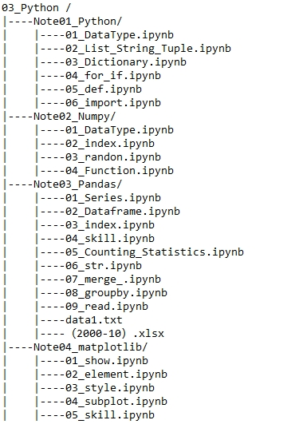

# 03_Python

## Introduction(介绍)

This repository records some notes of learning python. The programming tool is jupyter notebook, and the tutorial resource is AI engineer of Netease cloud classroom (computer vision),alicloud certified Python data scientific analysis practice, etc.

本仓库记录了学习python的部分笔记，编程工具为Jupyter Notebook，教程资源为网易云课堂AI工程师（计算机视觉）
，阿里云认证Python数据科学分析实战等。

This repository is divided into **five** parts for now:

本仓库目前分为**4个**部分：

- Note01_Python

- Note02_Nump

- Note03_Pandas

- Note04_matplotlib

## Contents(目录)

## Thanks(鸣谢）

- [AI engineer of Netease cloud classroom (computer vision)](https://mooc.study.163.com/smartSpec/detail/1001457001.htm)
- [网易云课堂AI工程师（计算机视觉）](https://mooc.study.163.com/smartSpec/detail/1001457001.htm)
- [alicloud certified Python data scientific analysis practice](https://edu.aliyun.com/certification/clda02?spm=5176.11999222.1216634.65.582f5e9bt5DCdZ)
- [阿里云认证Python数据科学分析实战](https://edu.aliyun.com/certification/clda02?spm=5176.11999222.1216634.65.582f5e9bt5DCdZ)